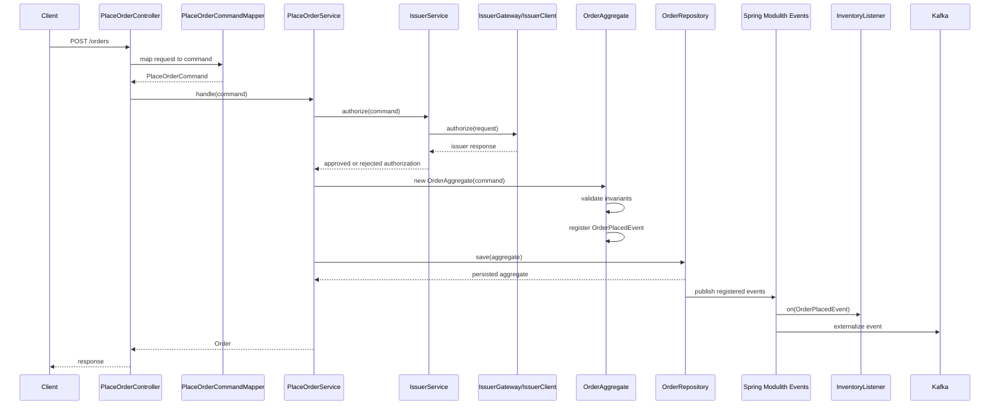
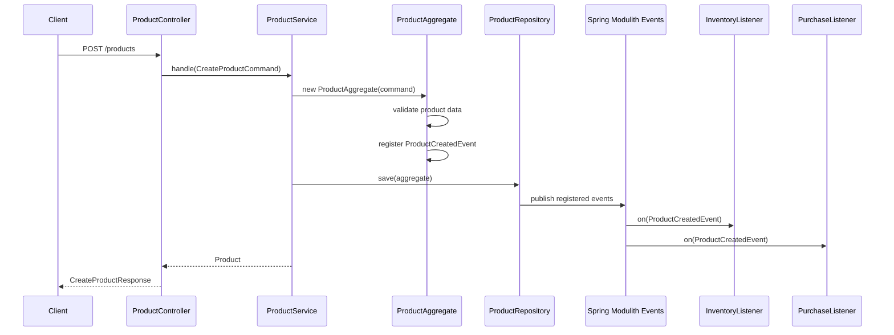

# Module Interactions

This guide explains how the main modules collaborate at runtime.

## Order Placement Flow



Key decisions:

- Issuer authorization happens before order persistence.
- `OrderAggregate` owns order invariants and event registration.
- Spring Modulith handles event publication after persistence.
- Inventory reacts through events, not direct order repository access.

## Product Creation Flow



Key decisions:

- Product data validation belongs in `ProductAggregate`.
- Inventory and purchase reactions are event listeners.
- Product creation does not call inventory or purchase modules directly.

## Cancellation Flow

```text
CancelOrderController
  -> CancelOrderService
    -> OrderRepository.findById(orderId)
    -> OrderAggregate.cancel()
      -> register OrderCancelledEvent
    -> OrderRepository.save(aggregate)
  -> CancelOrderResponse
```

`OrderAggregate.cancel()` prevents cancellation of completed orders and emits `OrderCancelledEvent`.

## Event Read Flow

```text
EventsController
  -> OrderEventService
    -> OrderEventRepository
      -> event publication table
  -> OrderEventResponse
```

Candid note: `EventsController` currently returns hardcoded fallback event responses if the service returns no stored event. Treat this as a rough edge and avoid copying the pattern into new production-shaped endpoints.

## Module Contract Table

| Module | Owns | Consumes | Publishes or reacts |
| --- | --- | --- | --- |
| `orders` | Order aggregate, repository, line items, order events | Issuer authorization through `orders.place` | `OrderPlacedEvent`, `OrderCancelledEvent` |
| `orders.place` | Place-order use case, issuer gateway/client | `OrderRepository`, `IssuerGateway` | Order aggregate events through save |
| `orders.cancel` | Cancel-order use case | `OrderRepository` | `OrderCancelledEvent` through aggregate |
| `orders.search` | Order lookup | `OrderRepository` | None |
| `orders.events` | Event read API | Modulith/event publication persistence | None |
| `products` | Product aggregate and create-product use case | `ProductRepository` | `ProductCreatedEvent` |
| `inventory` | Inventory reaction behavior | `OrderPlacedEvent`, `ProductCreatedEvent` | Logs simulated inventory changes |
| `purchases` | Purchase reaction behavior | `ProductCreatedEvent` | Logs simulated purchase flow |
| `logging` | Correlation, principal, traffic context | HTTP request lifecycle | MDC/structured logs |
| `security` | HTTP Basic and role configuration | Local/test users | Method and endpoint authorization |

## Cross-Module Rule

Good:

```java
@Component
class InventoryListener {

    @ApplicationModuleListener
    void on(OrderPlacedEvent event) {
        // react to a stable event contract
    }
}
```

Bad:

```java
@Component
class InventoryListener {

    private final OrderRepository orderRepository;

    void reserve(UUID orderId) {
        var order = orderRepository.findById(orderId).orElseThrow();
        // reaches into another module's persistence model
    }
}
```

The current ArchUnit rules also check that listener components do not depend on repositories.

